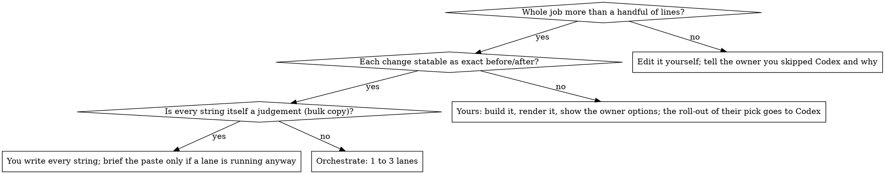

# Orchestrating Codex

## Overview

One Claude session is the **brain**; one to three persistent Codex CLI sessions are the **hands**, each working a **lane** of files in the same checkout, in parallel. Codex does exactly what it is told and is cheap, but judges poorly. Claude judges well and is expensive. So the brain reads the request, finds root causes, writes exact work orders (**briefs**) and judges the result; the hands make the edits.

**Core rule: the hands never make a decision, and the brain never types an edit a running lane could make from an exact brief.** A judgement call inside a brief is a call you skipped.

## When to use

The first two questions are asked of the whole job, the third of each item. Size is judged per job: once a lane is launching, a one-line item rides along in its brief. An owner who has declined questions ("don't ask me") still gets a judgement item built by you: one version shipped, alternatives offered in the report. Pays most at twenty or more changes across many files over several review rounds, where persistent lanes keep their context.

## Roles

| Role | Who | Does | Does not |
|---|---|---|---|
| Owner | the user | Reviews results, makes taste calls, sends the next round | Get asked things you can decide yourself |
| Brain | you | Diagnose to file and line, decide, write briefs, launch lanes, verify, run the build, own git, report | Edit what a running lane owns; guess at causes |
| Hands | 1 to 3 Codex lanes | Apply the brief exactly, run lint and named tests, report as `FILES / TESTS / CHECKS / NOTES` | Design, touch files outside the lane, run git, run the build, start servers |

Each extra lane is another brief to write and another boundary to police. Split when the areas persist across rounds or the job outgrows one brief; otherwise one lane.

## Quick reference

`<skill>` is this skill's directory; the scripts find the repo root themselves.

| Need | Command |
|---|---|
| Set up a checkout, once | `bash <skill>/scripts/init.sh`, then fill in `.context/codex/preamble.md` |
| Name the next brief | `bash <skill>/scripts/lane.sh --next <lane>` prints e.g. `ui-04`; save the brief as `.context/codex/briefs/ui-04.md` |
| Launch or resume a lane | `bash <skill>/scripts/lane.sh <lane> <absolute path to brief.md>` |
| New thread, same lane name | add `--fresh` |
| Where lanes stand; token totals | `bash <skill>/scripts/status.sh`; `status.sh --usage` |

A lane receives `preamble.md`, then the brief, then every file in `notes/`. Prompt, event log and report land in `.context/codex/out/<tag>.*`; thread ids in `sessions.txt`; plan paths in `plans.txt`.

Before the first launch, and whenever `.context/codex/` already exists, read `references/setup-and-sessions.md`.

## One round

1. **Take in the whole request.** Read every screenshot, log and note. Done when every item carries the owner's number, which then runs through plan, briefs and report.
2. **Diagnose before briefing.** Grep directly when items are few; fan out search subagents when there are many or the codebase is unfamiliar. Complaints name symptoms: "cards don't open" was a drag threshold swallowing clicks; "blurry logo" was a 64px image drawn at 120px. For visual complaints the browser is a diagnosis tool (`references/ui-verification.md`). Before briefing cuts to copy or data, grep the tests for floors and counts. Done when every item has a file, a line and a cause, or is **parked**: the source says the complaint cannot be true, the running thing agrees, and it becomes a question for the owner rather than an edit on a guess.
3. **Write the plan**: item, cause, fix, lane split, exact launch commands. Put it where the project keeps review docs (failing precedent, `docs/reviews/<date>-round-N.md`; it will be committed, so use `.context/codex/plans/` if the docs tree is owned) and append its path to `.context/codex/plans.txt`. Ask the owner only the decisions that are genuinely theirs, in one message, and carry on with everything that does not depend on the answer.
4. **Split into lanes by file ownership.** Done when no file appears in two lanes. A test file that pins strings from several areas lives in one lane; the other lanes' test runs go red on those pins until it lands, so name those tests in their briefs and tell them not to fix them. A fix that spans lanes is split so neither waits: the data lane makes a field optional, the component lane renders conditionally.
5. **Write one brief per lane.** Read `references/brief-template.md` before your first.
6. **Launch every lane in the same turn**, each as its own background command. A top-level session is re-invoked as each exits; a subagent is not, so if nothing wakes you, wait with one foreground loop (`until ! bash <skill>/scripts/status.sh | grep -q running; do sleep 20; done`, long timeout) rather than ending your turn.
7. **Use the wait** on the next briefs or on the judgement pieces that are yours, in files no lane owns. A piece that needs a lane's file waits for that lane to exit, then you edit it directly.
8. **Read each report, then read `git diff`.** Reports garble names and list untouched files; git is the ground truth. Done when every reported file's diff has been read.
9. **Verify against the owner's words.** Run it, screenshot it, click it. A passing acceptance check proves the hands did what you wrote; only the original complaint proves you wrote the right thing.
10. **Wrong once: a correction**, a one-paragraph brief under the next tag naming the item and the exact fix. **Wrong twice: do it yourself.** A second miss means the item was a judgement call all along.
11. **Gate.** Lint, the full suite, the build, the project's definition of done, all green.
12. **Commit in groups** by area, with whatever trailer the harness requires. Push, merge, deploy or open a PR only as authorised; otherwise leave the branch and say so.
13. **Report** per numbered item: what changed, where to look, what you decided on the owner's behalf, what is parked, what is open.

## Briefs, in short

- One section per item, numbered with the owner's ids; each with the file, the symbol or line, the exact before and the exact after. Exact strings in backticks; never an adjective ("clearer" comes back as more text).
- Ownership at the top, and what the other lanes own. Point the lane at its own items in the plan.
- One acceptance check per item that runs without a browser: a grep that must return nothing, a status code, a named test.
- About 150 lines; the rest is the next task. Standing rules go in `.context/codex/notes/<name>.md`.

## Red flags

Each was observed in a capable session working without this skill.

| Thought | Reality |
|---|---|
| "I've decided the design, so Codex can build it from my spec" | A composition nobody has rendered is a guess. Build it, look at it, show the owner options. |
| "Nothing blocks the start; send it all to Codex now" | Judgement items block on the owner seeing something rendered. Only the exact work starts now. |
| "The acceptance check passes, so the item is done" | "Two sentences max" was met by swapping a full stop for a comma. Judge against what the owner meant. |
| "I'll write the `codex exec` command by hand" | `resume` rejects `-s` and `-C` after the subcommand, and hand-rolled runs lose the thread id. Use `lane.sh`. |
| "The owner said use Codex, so these two lines go through a lane" | Make the edit, say you skipped Codex and why, offer the lane if they still want it. |
| "I couldn't make it work, so I removed it" | The owner will notice. Fix it, or say plainly that you could not. |

## Common mistakes

- **Asking a lane for screenshots.** The `workspace-write` sandbox cannot launch a browser or write outside the checkout.
- **Two builds in one checkout.** They fight over the output folder. One build, yours, at the gate.
- **Leaving a pinned test ambiguous.** Told to, Codex updates a test that asserts the old behaviour; not told, it may "fix" the code back to satisfy it. Say which way.
- **Relaunching a failed lane blind.** On a non-zero exit or empty report, read the tail of its `.jsonl`: an expired login, a trust prompt or a rate limit. The `error` item near the top about "skill descriptions were shortened" is noise.
- **Resuming one thread forever.** Past three to five tasks a thread gets slower and vaguer. Keep the lane name, launch `--fresh`.
- **A worktree per lane.** It multiplies installs, servers and merge reviews; file ownership already keeps lanes apart.
