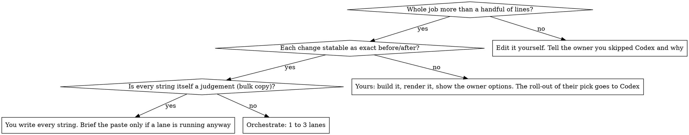

# Orchestrating Codex

## Overview

One Claude session thinks; one to three persistent Codex CLI sessions type, in parallel, in the same checkout. Codex does exactly what it is told and is cheap, but judges poorly: layout balance, whether a sentence earns its place, which of two fixes is right. Claude judges well and is expensive. So Claude's tokens go on reading the request, finding root causes, writing exact work orders and judging results; Codex's go on the edits.

**Core rule: Codex never makes a decision, and inside a running job you do not type an edit Codex could make from an exact brief.** If a brief contains a judgement call, the call was yours to make before writing it.

## When to use

If the owner has declined questions ("don't ask me"), a judgement item still does not go to Codex: build one version, ship it, and offer the alternatives in the report. Size is judged per job, not per item: once a lane is launching anyway, a one-line item rides along in its brief for almost nothing. A marginal job the owner asked to run this way gets one lane and a plain note that it was marginal. Pays most at twenty or more changes across many files, over several review rounds, where persistent sessions keep their context.

## Roles

| Role | Who | Does | Does not |
|---|---|---|---|
| Owner | the user | Reviews results, makes taste calls, sends the next round | Get asked things you can decide yourself |
| Brain | you | Diagnose to file and line, decide, write briefs, launch lanes, verify, run the build, own git, report | Edit what a running lane can edit; guess at causes |
| Hands | 1 to 3 Codex sessions, one per lane | Apply the brief exactly, run lint and named tests, report in a fixed format | Design, touch files outside the lane, run git, run the build, start servers |

Each extra lane is another brief to write and another boundary to police. One lane is fine; three is the usual ceiling.

## Quick reference

`<skill>` is this skill's directory. Run everything from the repo root.

| Need | Command |
|---|---|
| Set up a checkout (once) | `bash <skill>/scripts/init.sh`, then fill in `.context/codex/preamble.md` |
| Name the next brief | `bash <skill>/scripts/lane.sh --next <lane>` prints e.g. `ui-04`; save the brief as `.context/codex/briefs/ui-04.md` |
| Launch or resume a lane | `bash <skill>/scripts/lane.sh <lane> <brief.md>` as a background command, all lanes in the same turn |
| New thread, same lane name | add `--fresh` (new job, new theme, or thread past five tasks) |
| Where lanes stand | `bash <skill>/scripts/status.sh` |
| Codex token totals | `bash <skill>/scripts/status.sh --usage` |

The prompt a lane receives is `preamble.md`, then the brief, then every file in `notes/`. Prompt, event log and final report land in `.context/codex/out/<tag>.*`; thread ids in `.context/codex/sessions.txt`; plan paths in `.context/codex/plans.txt`.

Before the first launch, and whenever `.context/codex/` already exists, read `references/setup-and-sessions.md`: git and dev-server setup, what goes in the preamble, thread hygiene, picking up an old checkout.

## One round

1. **Take in the whole request.** Read every screenshot, log and note. Number each item; the owner's numbers carry through the plan, the briefs and the report.
2. **Diagnose before briefing.** Find the file, the line and the actual cause of each item. Grep directly when items are few; fan out search subagents when there are many or the codebase is unfamiliar. Expect complaints to name symptoms: "cards don't open" was a drag threshold swallowing clicks; "blurry logo" was a 64px image drawn at 120px. Briefing the symptom wastes a round.
   - For visual complaints the browser is a diagnosis tool, not only a verification tool (`references/ui-verification.md`).
   - **If the source says the complaint cannot be true**, check the running thing. If it still does not reproduce, it becomes a question in the round report, not a brief. Do not edit on a guess.
   - Before briefing cuts to copy or data, grep the tests for floors and counts that bound the new state.
3. **Write the round's plan**: item, cause, fix, then the lane split and the exact launch commands. Put it where the project keeps review docs (failing precedent, `docs/reviews/<date>-round-N.md`) and append its path to `.context/codex/plans.txt`. Ask the owner only the decisions that are genuinely theirs, in one message, and **carry on with everything that does not depend on the answer**. An item that needs the owner is parked, not a blocker.
4. **Split into lanes by file ownership**, usually by directory. Two lanes never touch the same file. A shared test file that pins strings from several areas is the usual reason a split collapses: it lives in one lane and the items it pins go with it. When a fix spans lanes, split it so neither waits: the data lane makes a field optional, the component lane renders it conditionally.
5. **Write one brief per lane.** Read `references/brief-template.md` before your first one.
6. **Launch every lane in the same turn**, each as its own background command, so they run in parallel. A top-level session is re-invoked as each exits; a subagent is not, so if nothing wakes you, wait with one foreground loop (`until ! bash <skill>/scripts/status.sh | grep -q running; do sleep 20; done`, long timeout) rather than ending your turn.
7. **Use the wait.** Write the next briefs or build the judgement pieces that are yours, in files no lane owns. Edits to lane-owned files wait until that lane exits.
8. **Read each report, then trust git over the report.** Codex sometimes lists a file it never touched. `git status` and `git diff` are the ground truth.
9. **Verify yourself, against the owner's words.** Run it, screenshot it, click it. A passing acceptance check proves Codex did what you wrote; only the original complaint tells you whether you wrote the right thing.
10. **Wrong once: send a correction**, a one-paragraph brief under the next tag naming the item and the exact fix. **Wrong twice: do it yourself.** A second miss usually means the item was a judgement call all along.
11. **Gate.** Lint, the full test suite, the build, the project's own definition of done. Only you run the build.
12. **Commit in groups** by area, plain messages plus whatever trailer the harness requires. Push, deploy, merge or open a PR only as the user has authorised; otherwise leave the branch and say so in the report.
13. **Report**: what changed per numbered item, where to look, what you decided on the owner's behalf, parked questions, what is open.

## Briefs, in short

- One section per item, numbered with the owner's item ids; each with the file, the symbol or line, the exact before and the exact after.
- Exact strings in backticks: class names, copy, signatures, routes. Never an adjective. "Make it clearer" comes back as more text.
- Ownership at the top, and what the other lanes own. Point the lane at its own items in the plan, not the whole plan.
- One acceptance check per item that runs without a browser: a grep that must return nothing, a status code, a named test. A small guard test that serves as the check is in scope.
- About 150 lines or a few dozen items; send the rest as the next task.
- Rules that apply from now on go in `.context/codex/notes/<name>.md`, which rides along on every prompt.

## Red flags

Each of these was observed in a capable session working without this skill.

| Thought | Reality |
|---|---|
| "I've decided the design, so Codex can build it from my spec" | A composition nobody has rendered is still a guess. Build it, look at it, show the owner options. Codex gets the roll-out of the pick. |
| "Nothing blocks the start; send it all to Codex now" | Judgement items block on the owner seeing something rendered. Only the exact work starts now. |
| "The acceptance check passes, so the item is done" | "Two sentences max" was met by swapping a full stop for a comma. Judge against what the owner meant. |
| "Codex's report says it changed the file" | Reports garble names and list untouched files. Read `git diff`. |
| "One more brief will get it" (after two misses) | The third brief costs more than the edit. Do it yourself. |
| "I'll write the `codex exec` command by hand" | `resume` rejects `-s` and `-C` after the subcommand, and hand-rolled runs lose the thread id. Use `lane.sh`. |
| "The owner said use Codex, so these two lines go through a lane" | Make the edit, say plainly that you skipped Codex and why, offer the lane if they still want it. |
| "I couldn't make it work, so I removed it" | The owner will notice. Fix it, or say plainly that you could not. |

## Common mistakes

- **Asking a lane for screenshots.** The `workspace-write` sandbox cannot launch a browser or write outside the checkout.
- **Two builds in one checkout.** They fight over the output folder. One build, yours, at the gate.
- **Leaving a pinned test ambiguous.** Codex will update a test that asserts the old behaviour if told to, and otherwise may "fix" the code back to satisfy it. Say which way in the brief.
- **Relaunching a failed lane blind.** On a non-zero exit or empty report, read the tail of its `.jsonl` first; the usual causes are an expired login, a trust prompt, or a rate limit. (The `error` item near the top about "skill descriptions were shortened" is noise.)
- **Resuming one thread forever.** Past three to five tasks a thread gets slower and vaguer. Keep the lane name, launch `--fresh`.
- **A worktree per lane.** It multiplies installs, servers and merge reviews for no gain; file ownership already keeps lanes apart.
